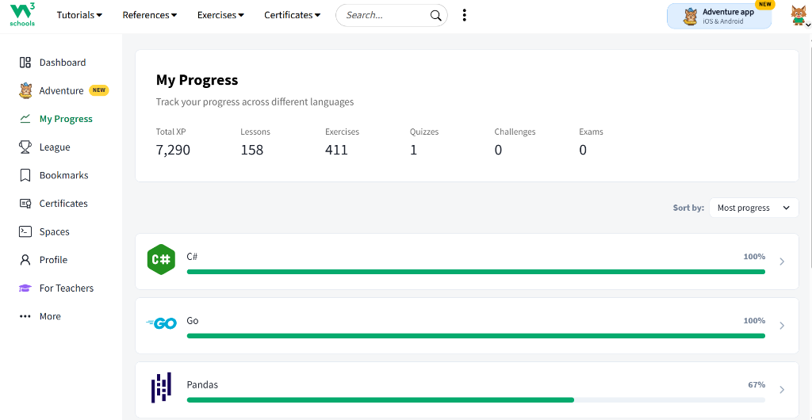

# Hi, I'm Robiul Sunny Emon

### Full-Stack & Distributed Systems Engineer | Cloud & Mobile Architect

**Computer Science & Engineering Student at Bangamata Sheikh Fojilatunnesa Mujib Science & Technology University (BSFMSTU)**  
Specialized in Enterprise Microservices (Spring Boot 3, Go, FastAPI), Event-Driven Architecture (Saga Pattern), AWS Cloud Infrastructure, and Cross-Platform Mobile Applications (Flutter).

  
  
  
  
  

---

## About Me

- **Core Focus**: Designing and implementing scalable, fault-tolerant distributed backends, cloud-native services, and responsive cross-platform mobile applications.
- **Cloud & Infrastructure**: Actively working with **Amazon Web Services (AWS)** and preparing for the **AWS Certified Solutions Architect – Associate (SAA-C03)** examination.
- **Backend & Systems**: Architecting polyglot systems using **Go (Golang)**, **Java 21 (Spring Boot 3, Spring Cloud)**, and **Python (FastAPI)** with event-driven pipelines (RabbitMQ Saga Pattern).
- **Technical Writing**: Regularly publishing cloud computing deep-dives and architectural guides on **Hashnode**.
- **Mobile Engineering**: Developing production-grade mobile applications with Flutter, following Clean Architecture and modern state management patterns (GetX, BLoC, Riverpod, Provider), along with native hardware and sensor integrations.
- **UI/UX & Product Design**: Creating modern, user-centric interfaces and interactive prototypes in Figma.

---

## Work Experience

#### **Software Engineer** — [maktech](https://www.linkedin.com)
*Dhaka, Bangladesh • Hybrid*  
`Jun 2026 – Present`

- Promoted to Software Engineer following impactful delivery as Associate Engineer.
- Architecting scalable enterprise backend services, microservices, and robust APIs.
- Specializing in high-performance backend systems with Java and Spring ecosystem.
- **Core Tech**: GO, AWS, Core Java, Java Spring Boot, Spring Cloud, Microservices, PostgreSQL.

---

#### **Associate Software Engineer** — [maktech](https://www.linkedin.com)
*Dhaka, Bangladesh • Hybrid*  
`Jul 2025 – Jun 2026 (1 year)`

- Encompassed full-stack responsibilities delivering production mobile and backend solutions.
- Focused on building resilient, decoupled modules, state management, and API integrations.
- **Core Tech**: Python, FastAPI, Flutter, GetX, Clean Architecture, RESTful Services.

---

#### **Software Developer (Intern)** — OmegaSoft BD
*Dhaka, Bangladesh • Remote*  
`Feb 2025 – Jul 2025 (6 months)`

- Engineered a scalable SaaS-based Point-of-Sale (POS) system for SMEs with enhanced modular architecture.
- Collaborated across the full Software Development Life Cycle (SDLC) for mobile and web components.
- **Core Tech**: Mobile Application Development, Flutter, SDLC, Modular Design.

---

## Technical Writing & Cloud Blog

I actively document my cloud computing journey and architectural insights on [robiulsuny.hashnode.dev](https://robiulsuny.hashnode.dev):

<!-- HASHNODE-CARDS:START -->
<table width="100%" border="0" cellspacing="10" cellpadding="0">
  <tr>
    <td width="50%" valign="top">
  
    
  <a href="https://robiulsuny.hashnode.dev" target="_blank" style="text-decoration: none;">
    <h3>AWS Academy Cloud Foundations (Module 02)</h3>
  </a>
  
Cloud Economics and Billing (ক্লাউড অর্থনীতি এবং বিলিং)

  
⏱️ 11 min read

</td>
    <td width="50%" valign="top">
  
    
  <a href="https://robiulsuny.hashnode.dev" target="_blank" style="text-decoration: none;">
    <h3>AWS Academy Cloud Foundations (Module 01)</h3>
  </a>
  
১. ভূমিকা (Introduction) আজকের তথ্যপ্রযুক্তির যুগে Cloud Computing শব্দটি আমরা প্রতিনিয়ত শুনে থাকি...

  
⏱️ 6 min read

</td>
  </tr>
</table>
<!-- HASHNODE-CARDS:END -->

  

---

## Engineering Principles & Architecture

- **Distributed Systems**: Saga Pattern (Choreography & Rollbacks), Event-Driven Architecture, Microservices Decomposition.
- **Cloud Architecture**: High Availability (HA), Fault Tolerance, Decoupled Services, AWS Well-Architected Framework.
- **Backend Architecture**: Domain-Driven Design (DDD), Repository-Service Pattern, Clean Code Standards.
- **Mobile Patterns**: Clean Architecture, Separation of Concerns, Reactive State Management (GetX, BLoC).
- **Security & Resilience**: Defense-in-depth, Role-Based Access Control (RBAC), JWT Rotation, Bcrypt/Argon2 Hashing, Self-Healing Connection Pooling.

---

## Architectural Highlights & Case Studies

- **Distributed Consistency in Fintech**: Implemented RabbitMQ event-driven Saga choreography in `micro-wallet` to ensure transactional integrity across multi-service digital wallets with automated compensation and rollbacks.
- **Ultra-Low Latency Streaming**: Integrated LiveKit WebRTC SFU in `instalive` to achieve sub-500ms broadcast latency with real-time room webhooks and an automated 3-second unpaid viewer preview timeout.
- **Zero-DB-Clutter OTP Engine**: Architected an ephemeral OTP verification flow in `grandmart` using Upstash Redis TTL, eliminating relational database write overhead during registration peaks.
- **Smart Subscription Detection Engine**: Designed a time-delta and merchant grouping algorithm in `Subsync` to automatically identify recurring billing cycles (weekly, monthly, yearly) from raw bank transactions.

---

## Skills & Capabilities

<table border="0">
  <tr>
    <td width="50%" valign="top">
      <h4>Backend & Distributed Systems</h4>
      
      
      
      
      
      
      
        
      <h4>Cloud, DevOps & Tooling</h4>
      
      
      
      
      
      
      
        
      <h4>Messaging & Streaming</h4>
      
      
      
    </td>
    <td width="50%" valign="top">
      <h4>Mobile Development</h4>
      
      
      
      
      
      
        
      <h4>Databases, ORM & Caching</h4>
      
      
      
      
      
        
      <h4>UI/UX & Languages</h4>
      
      
      
    </td>
  </tr>
</table>

---

## Problem Solving & Algorithms

Demonstrated foundation in Data Structures, Algorithms, and System Design through continuous practice:

  
  
  

---

## Current Focus & Certifications

- 🎯 **Target Certification**: Preparing for the **AWS Certified Solutions Architect – Associate (SAA-C03)**.
- 🐹 **Systems Engineering**: Building concurrent, cloud-native services and CLI tooling with **Go (Golang)**.
- ✍️ **Technical Writing**: Authoring AWS architectural and foundational articles on **Hashnode**.
- 🤖 **AI Engineering**: Exploring LLM orchestration and Agent Tool Calling within mobile applications.

---
## Learning Progress & Skill Verification

Continuous learner committed to expanding language proficiencies and CS fundamentals. Verified coursework and problem-solving metrics on [W3Schools Profile](https://www.w3profile.com/robiulsunyemon/):

  
  
  

<!-- W3Schools Screenshot Card -->

  

  Key Milestones: <b>Go (100% Completed)</b> • <b>C# (100% Completed)</b> • <b>Pandas (Data Analysis)</b>

---

## Development Environment & Workflow

- **Operating Systems**: Windows, Linux (Ubuntu/Debian)
- **Cloud & Containers**: Amazon Web Services (AWS), Docker, Docker Compose
- **IDEs**: GoLand, IntelliJ IDEA, VS Code, Android Studio
- **API & Testing**: Postman, Swagger/OpenAPI, Bruno, Testcontainers
- **VCS & Automation**: Git, GitHub CLI, GitHub Actions

---

## Featured Engineering Projects

| Domain | Project | Description & Architecture | Tech Stack |
| :--- | :--- | :--- | :--- |
| Fintech | [micro-wallet](https://github.com/robiulsunnyemon/micro-wallet) | 11-service distributed fintech ecosystem with SAGA choreography, RabbitMQ, PostgreSQL per service, MongoDB immutable audit trails & Python KYC | Java 21, Spring Boot 3, Spring Cloud, RabbitMQ, Postgres, MongoDB, Redis, Docker |
| Media & Social | [instalive](https://github.com/robiulsunnyemon/instalive) | Real-time live broadcasting with LiveKit WebRTC, pay-per-view with timed preview, coin economy, animated live gifts & private chat | Flutter, FastAPI, LiveKit SFU, MongoDB (Beanie), WebSockets, Stripe |
| E-Commerce | [nexprime-multivendor](https://github.com/robiulsunnyemon/nexprime_multivendor_project) | Multi-vendor marketplace with LiveKit live video shopping, WebSocket chat, sub-order splitting, and automated Stripe vendor payouts | Python 3.11, FastAPI, Prisma ORM, LiveKit, WebSockets, Stripe, PostgreSQL |
| SaaS & Finance | [subsync](https://github.com/robiulsunnyemon/Subsync) | Automated subscription & recurring expense tracker SaaS with bank transaction pattern engine, billing forecasting & PDF reports | Java 21, Spring Boot 3.2, PostgreSQL, Flyway, Flutter, Dio, GetX |
| Enterprise API | [grandmart](https://github.com/robiulsunnyemon/grandmart) | High-concurrency async multi-vendor platform with zero-DB-clutter Redis OTP, self-healing DB pools & customer mobile app | FastAPI, SQLModel, PostgreSQL (AsyncPG), Upstash Redis, Alembic, Flutter |
| Field Survey | [otzar](https://github.com/robiulsunnyemon/otzar) | Scientific geological specimen survey app with camera capture, real-time GPS geocoding, compass heading & biometric local auth | Flutter (Sensors & Local Auth), FastAPI, SQLModel, Alembic, PostgreSQL |
| Food Delivery | [alkhalifa](https://github.com/robiulsunnyemon/alkhalifa) | Multi-tenant restaurant & delivery ecosystem with customer ordering app, Flutter web admin dashboard & zone-based fee matrix | FastAPI, Prisma, PostgreSQL, Flutter Mobile, Flutter Web Admin |
| Services Backend | [power-system-backend](https://github.com/robiulsunnyemon/power_system_backend) | Robust services marketplace backend API with order workflows, dispute resolution & Firebase push notifications | FastAPI, Prisma Python, PostgreSQL, Firebase Admin, Stripe |
| Mobile Commerce | [dhaka-shop](https://github.com/robiulsunnyemon/Dhaka-Shop) | Clean architecture e-commerce mobile app with modular state bindings, cart, localized checkout, and responsive design | Flutter, GetX Pattern, ScreenUtil, Dio |

---

## GitHub Stats & Activity

<table border="0" width="100%">
  <tr align="center">
    <td width="50%">
      
    </td>
    <td width="50%">
      
    </td>
  </tr>
</table>

  

 

  

---

## Contact

- **Email**: [robiulsunyemon@gmail.com](mailto:robiulsunyemon@gmail.com)
- **Blog**: [robiulsuny.hashnode.dev](https://robiulsuny.hashnode.dev)
- **GitHub**: [@robiulsunnyemon](https://github.com/robiulsunnyemon)
- **LinkedIn**: [Robiul Sunny Emon](https://www.linkedin.com/in/robiulsunnyemon)
- **NeetCode**: [LuckyVulture227](https://neetcode.io/user/LuckyVulture227)

---

  <blockquote>
    <i>"Code is like humor. When you have to explain it, it’s bad."</i> — <b>Cory House</b>
  </blockquote>

